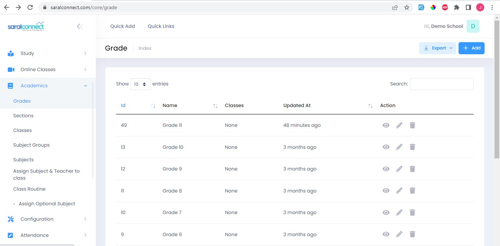
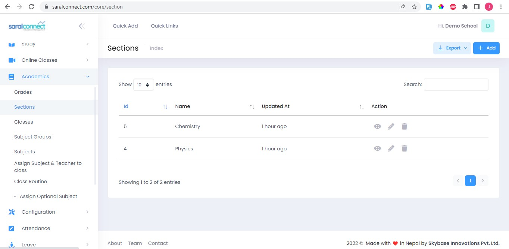
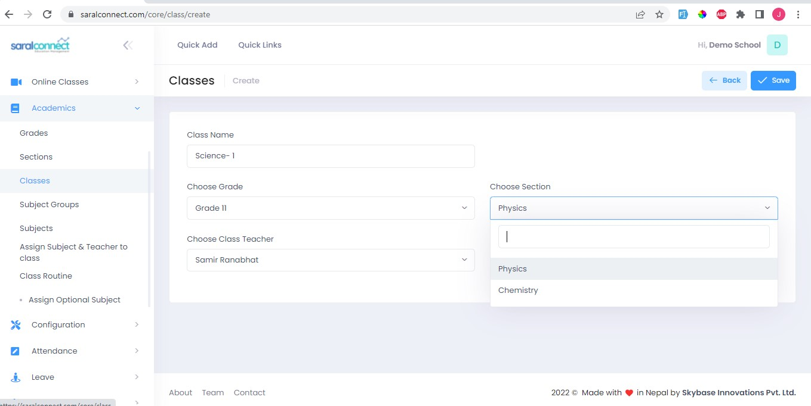

###**Step 1: Add Grade**

Here we add grades like Grade 1, Grade 2, etc. A grade can have many sections and classes.

1. Go to Academics
 2. Select Grade
 3. Click Add and enter grade.
 4. Click Save
 
 
 
###**Step 2: Add Sections**

Section is subset of Grade. Example: Section A, Section B etc

 1. Go to Academics
 2. Select Section
 3. Click Add and enter sections.
 4. Click Save
 
 
 
###**Step 3: Add Classes**

Example: Section A of Grade 10 can be class, Section B of Grade 10 can be another class. Similarly, Section A of Grade 2 can be another class

 1. Go to Academics
 2. Select Classes
 3. Click Add and enter sections.
 4. Click Save
 
 
 
 
 
