

In exam module, you can do all the exam related activity of the student of the school. Here, you can set exam name, exam weightage (%), entry full/pass marks, generate marks ledger, generate mark sheets class wise etc. Here are the some steps to operate exam module. 

- Manage Subject
- Manage Exam
- Exam Weightage
- Evaluation Parameter
- Marks Entry
- Quality Measure
- Marks Ledger
- Mark sheet

###**Step:1**

Under this, you can create a compulsory subject as well as elective subject and associate them to respective program. This can be done under following steps:

- Enter subject,subject type
- Enter credit hours

####**Subject**

Here, you can manage all the subject records in Saral Connect Cloud software. For individual data insertion:

1. Go to: Academics
2. Select Subjects
3. Click Add
4. Enter all the details 
5. Click Save

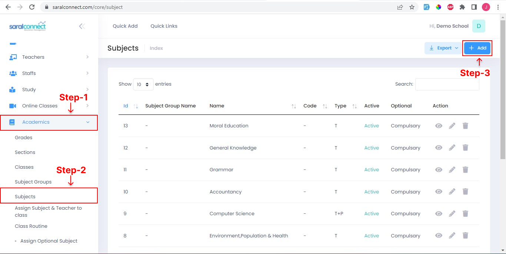
 
 

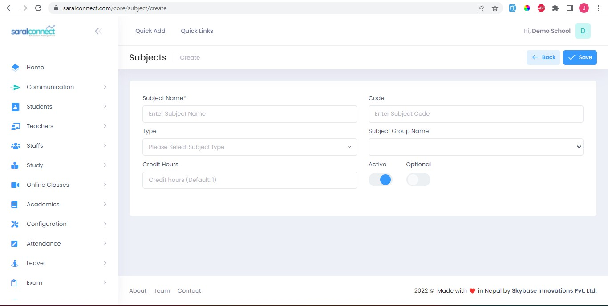
 
 

###**Step:2**

Under this, you can change grades and percentage marks if you wish to.

####**Change grades**

1. Go to: Exam
2. Select Mark grades
2. Edit or Add grades
4. Enter Details
5. Click Save

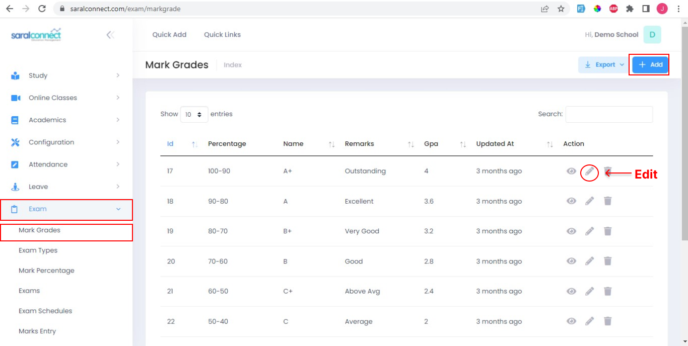

Click edit icon to edit and click update to save the changes.

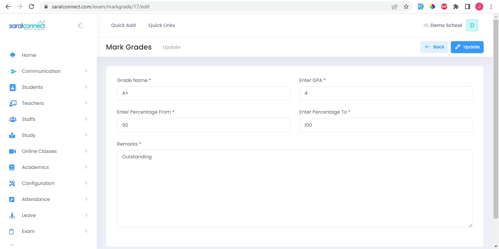

Click add button to add new entries.

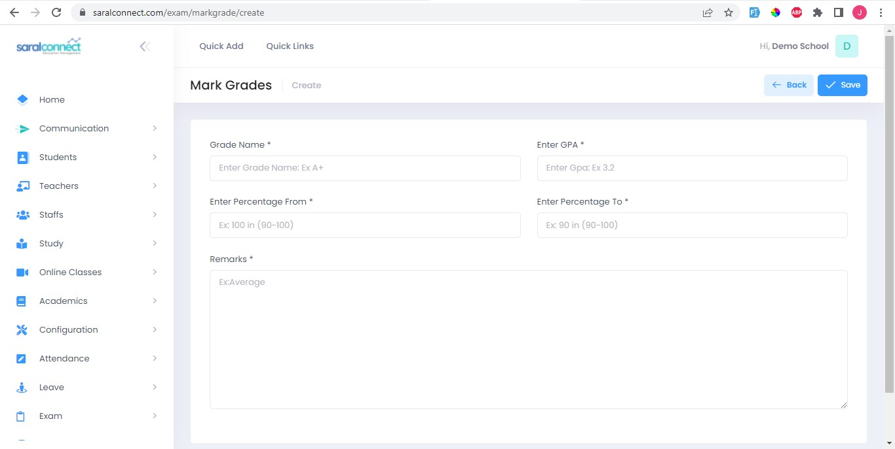

####**Change percentage**

1. Go to: Exam
2. Select Mark percentages
2. Edit or Add percentage
4. Enter Details
5. Click Save

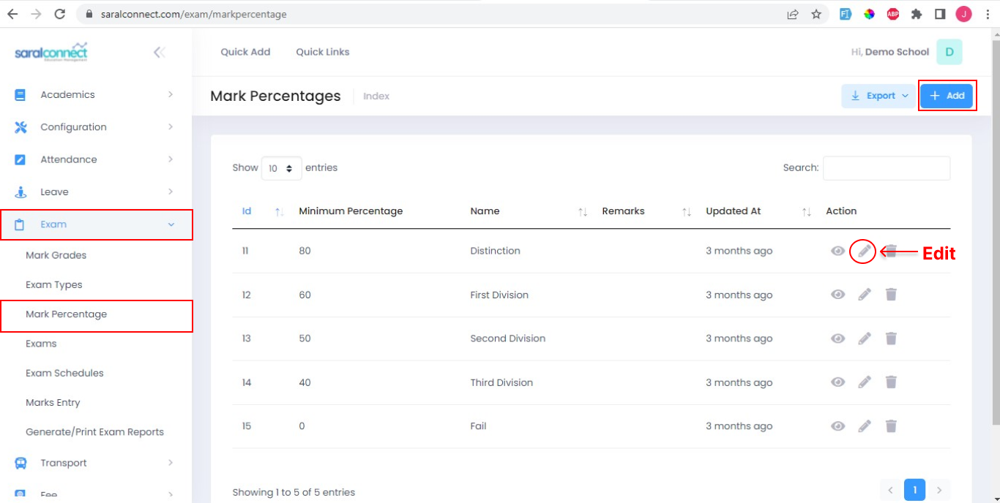

Click edit icon to edit and click update to save the changes.

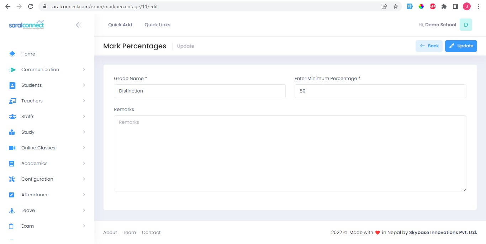

Click add button to add new entries

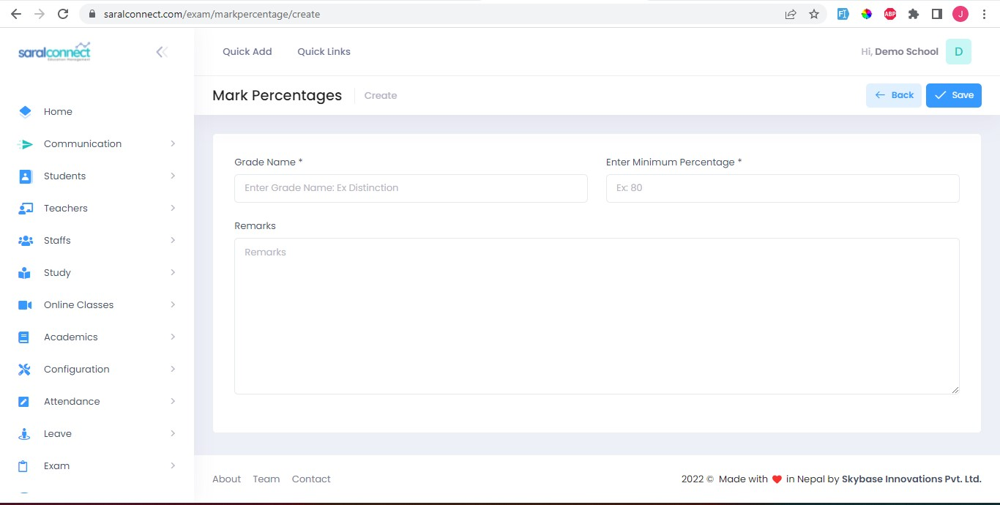
 
 

###**Step:3**

Under this, you can create a new exam-type and add its weightage as well. This can be done under following steps:

- Enter exam type
- Enter weightage

####**Add Exam Type**

1. Go to: Exam
2. Select Exam Type
2. Click Add
4. Enter Details
5. Click Save

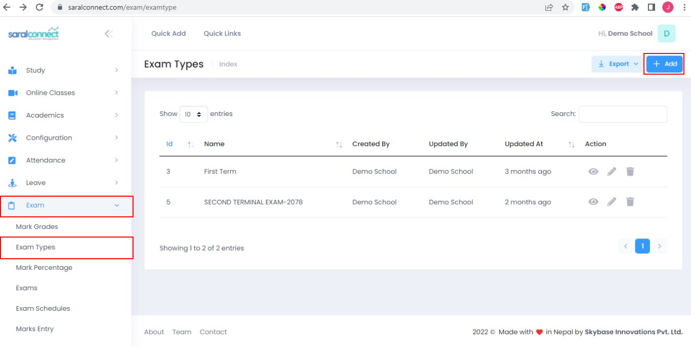

Click add button to add new entries
 
**Example:** Exam type can be: First terminal Exam  
Exam weightage can be 20%, 30%

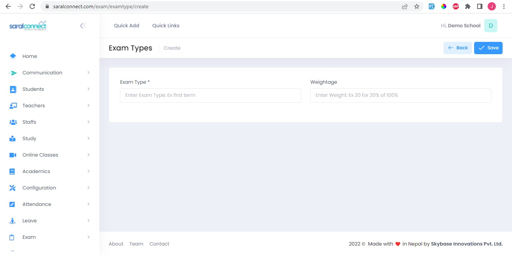

###**Step:4**

Under this, you can create a new exam.

####**Add Exam**
1. Go to: Exam
2. Select Exam 
2. Choose Class and Exam Type
4. Enter Find Exam Details

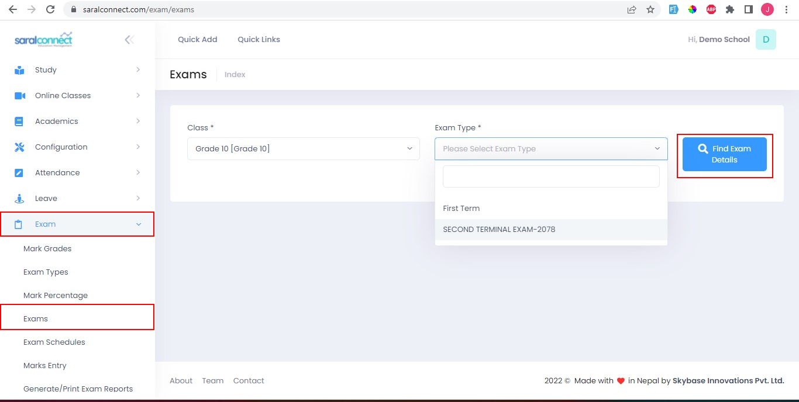

We can set theory and practical full and pass marks individually and at bulk as well. Tick has practical
if the subject has practical marks. And, Click Update.

 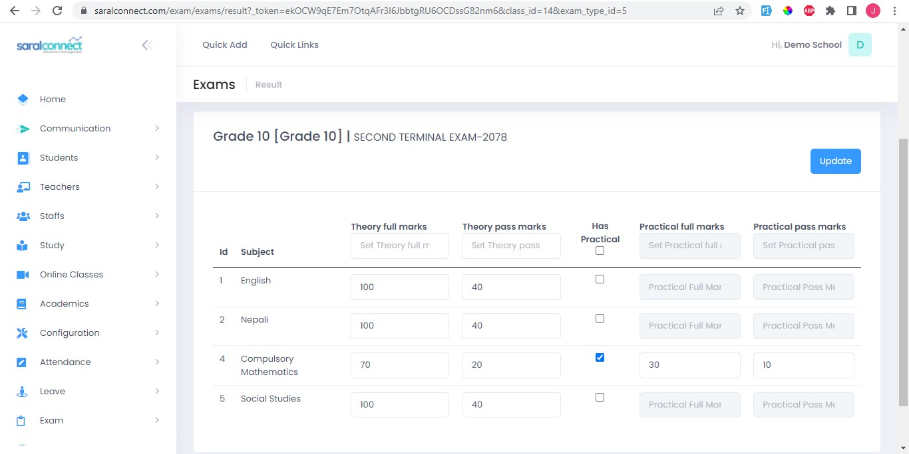

