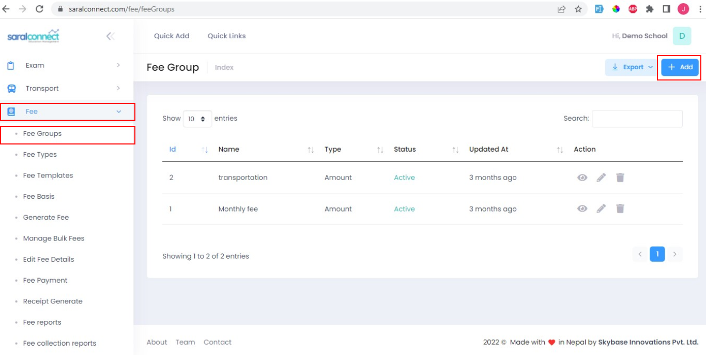
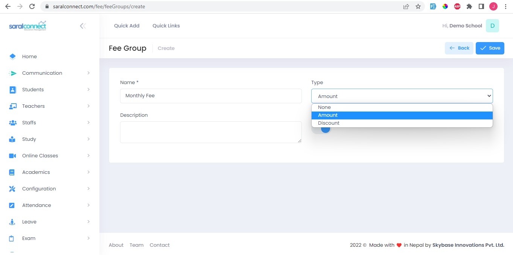
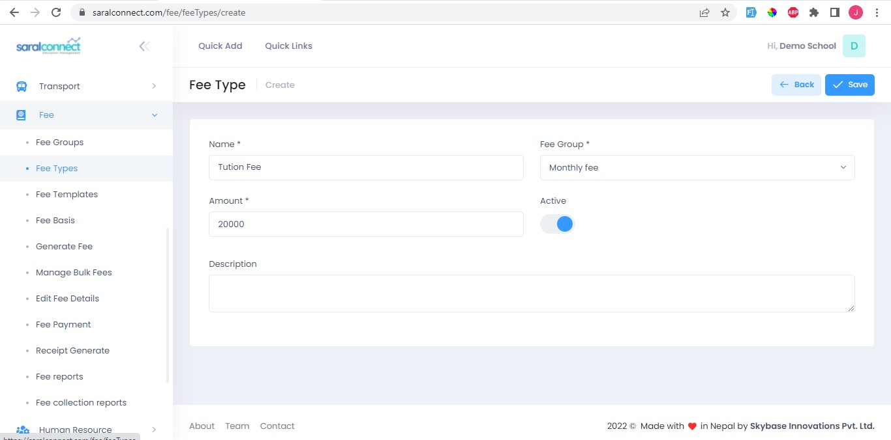
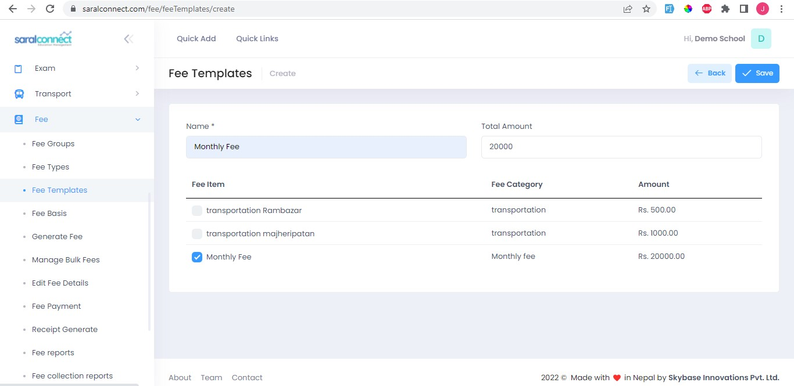
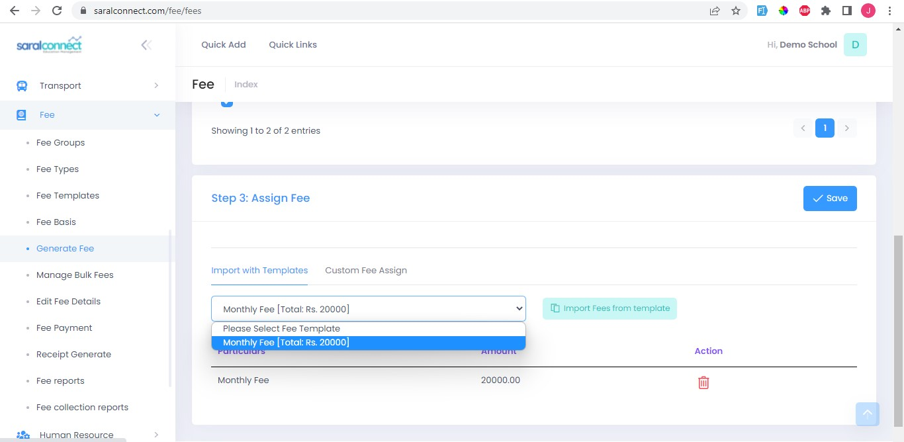
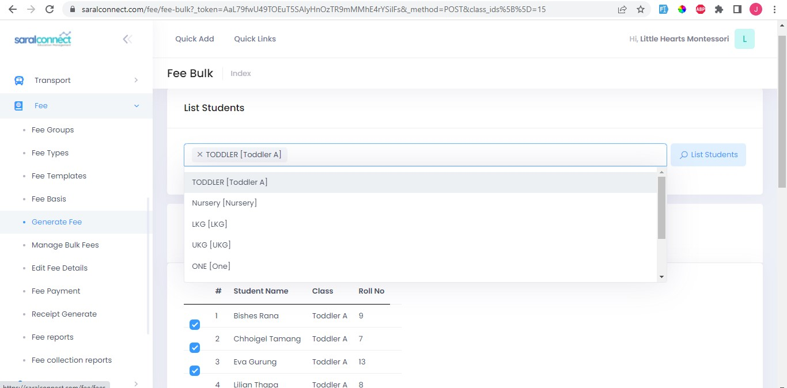
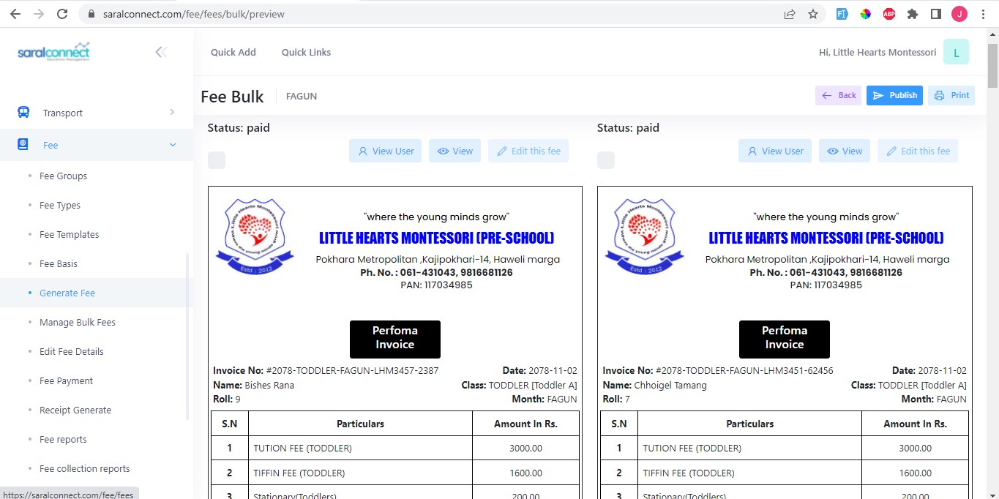
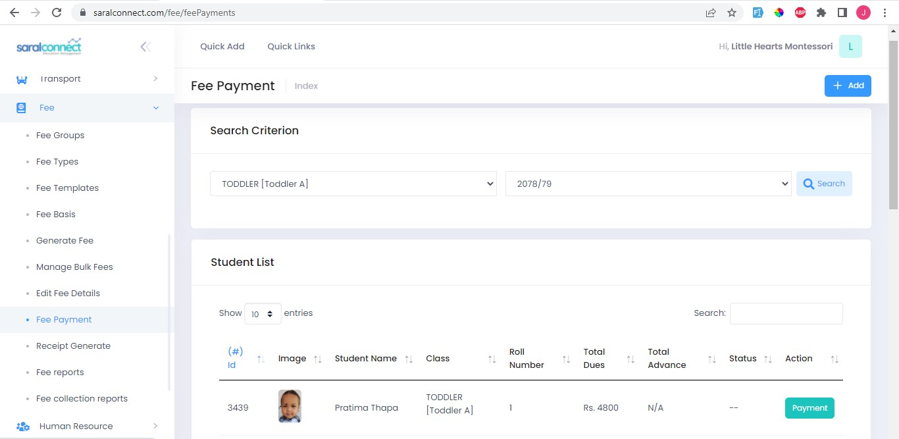
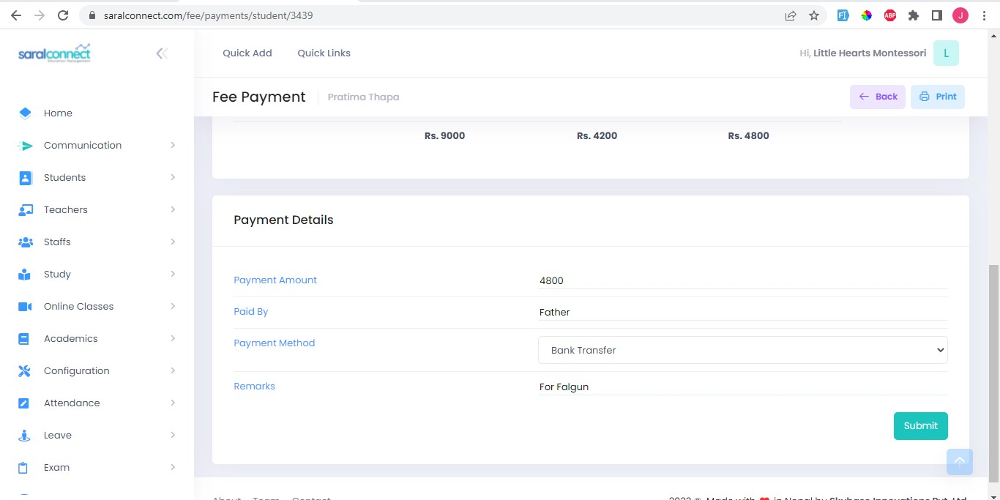

###**Step 1:Add Fee Groups**

The fee group consists of different type of fees like monthly fee, Miscellaneous fee etc.

1. Go to: Fees
2. Select Fee Group
3. Click Add

 
 
 Enter Details and click save.

 
 

###**Step 2:Add Fee Type**

The fee types can be first terminal fee, second terminal fee etc.

1. Go to: Fees
2. Choose Fee Type
3. Click Add
4. Enter Details
5. Click Save

 
 
###**Step 3:Add Fee Template**
 
 1. Go to: Fees
 2. Choose Fee Template
 3. Click Add
 4. Enter Details
 5. Click Save
 
  
  
###**Step 4:Generate Fees**
   
   1. Go to: Fees
   2. Choose Generate Fees
   3. Select Fee Month, Session and class
   4. Click List Students

 
 
 Then you can see the details. 
  
 You can also include the template and click save.  
 Then you can see the fee of individual student.
 
  
  
  

###**Step 5:Manage Bulk Fees**

Manage bulk fee is to preview and print the fee receipt for every student in the class.
   
   1. Go to: Fees
   2. Choose Manage Bulk Fees
   3. Select class you want to show the fee of.
   4. Click List Students

 
 
 It shows the list of every student studying in the selected class.
 
 Then,
  5. Choose the month and session you want to show the fee for and 
  6. Click preview & print
  
After we click print & preview we can see the fee receipt for every students as below

  
  
  If we click the publish button situated in the top-right position, we can publish the receipt in App for that specific student that. After publishing the receipt we cannot change/edit the fee details.
  
  If we click the print button, we can print that fee receipt in A4 sized paper.
  
  
###**Step 6:Fee Payment**

When the payment is made by student or their parents, we can store the payment details.
   
   1. Go to: Fees
   2. Choose Fee Payment
   3. Select class of the students and the session the payment is made for. 
   4. Click Search
   
   It shows the student list for the selected class and their total dues.
   
   
   
   5. Click the payment button for the student who is making the payment.
   6. Enter details
   7. Click Submit.
   
   
   
   
###**Step 7:Receipt Generate**

Here, we can print and view the receipt.

   1. Go to: Fees
   2. Choose Receipt Generate
   3. You can search the student from thw list
   4. Click view/print to see the payment details.
  
   
   
   
  
 
   
   
 
   
  
  
 
 

