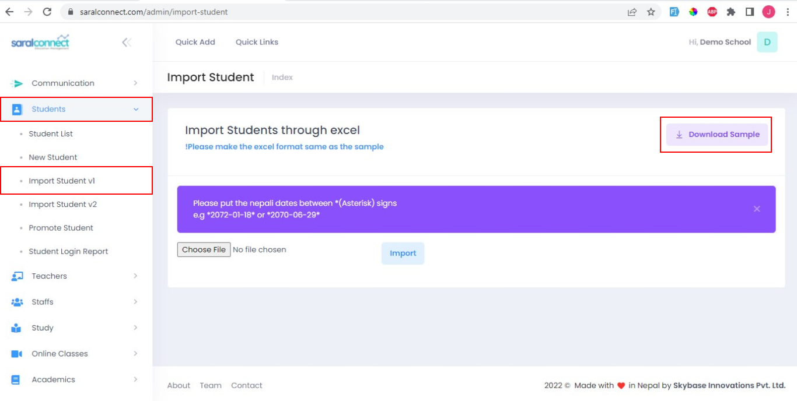
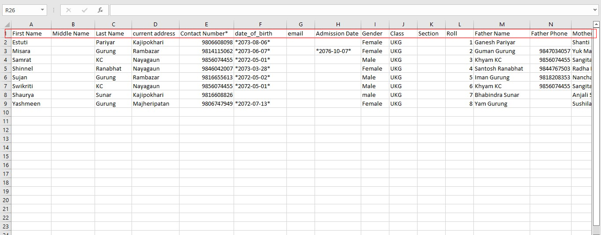

 
###**Import Students**
 
 1. Go to Students
 2. Select Import Student v1
 3. Click Download the sample to see how the data should me entered.
 
 
 
 The sample looks like
 
  
  
  Do not change the headings like First Name, Middle Name etc.
  
  Note: Please put the nepali dates between *(Asterisk) signs
        e.g * 2072-01-18 * or * 2070-06-29 *
         
 
Then choose the file/ Excel and click import.
