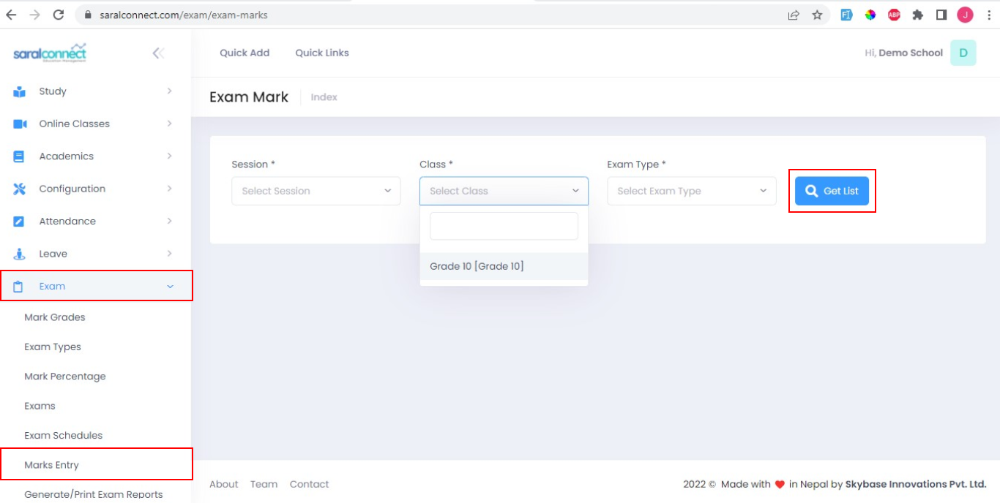
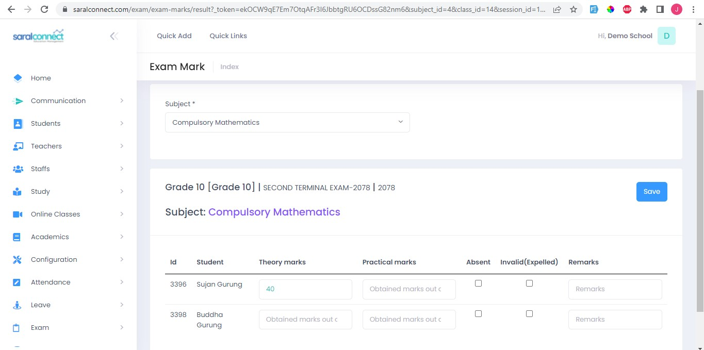

Academic staffs play the role in marks entry.

####**Choose Exam**

1. Go to: Exam  
2. Select Marks Entry 
3. Choose Session, class and Exam type 
4. Click on Get list

After we click get list then we enter the marks for every subject for every student. And click save to save the entries.

