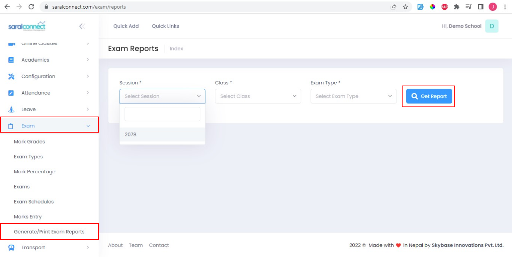
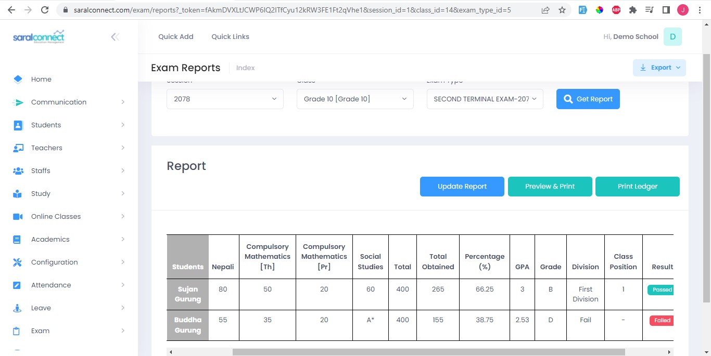
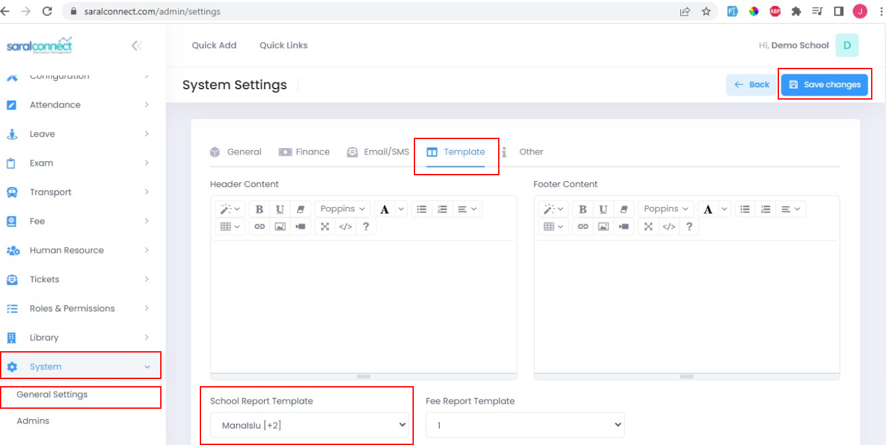
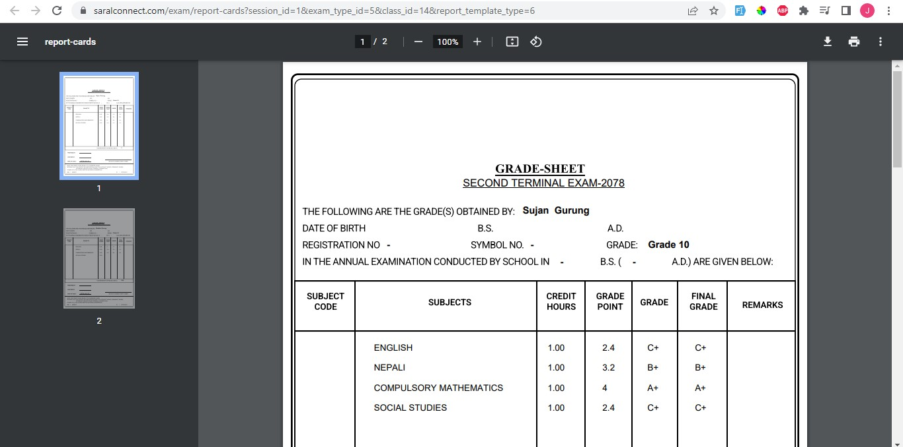

####**Generate Exam Reports**

1. Go to: Exam  
2. Select Generate/Print Exam Reports 
3. Choose Session, class and Exam type 
4. Click on Get Report

Aftet we click get report, we can see the marks ledger.
  It shows the marks of every student in each table with their total grades obtained in tabular form.

 

####**Print Marksheet**

In order to generate marksheet, you will need to choose the marksheet theme. For this puropse
 

1. Go to: System
2. Select General Settings.
3. Choose templates.
4. Select your theme.
5. Click Save changes

(Note: Your custom theme will be designed and provided by the saral connect team)

After this you can go back to your mark ledger page following the same steps mentioned above in Exam marks entry and click preview and print.
 
The marksheet will be automatically generated for each students at once.

