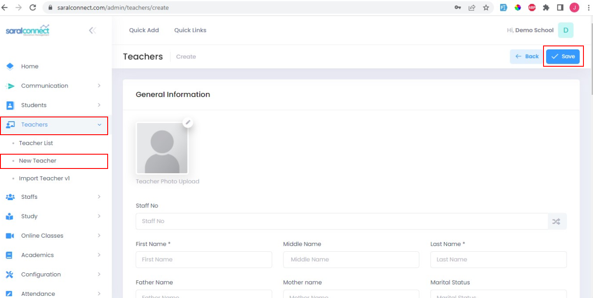
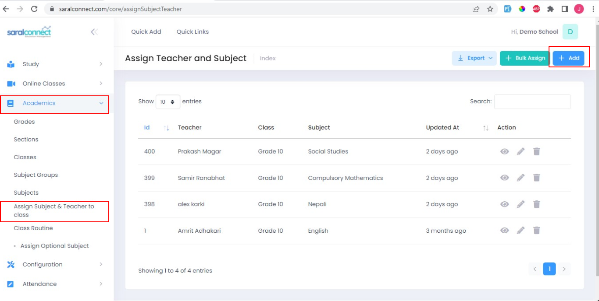
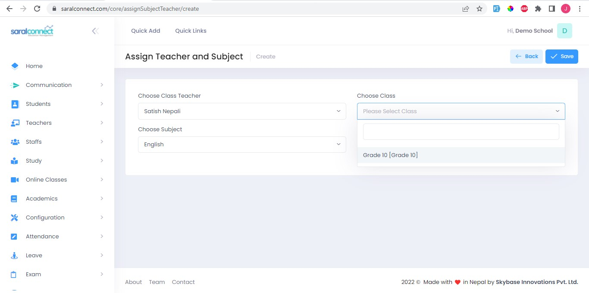

###**Step 1: Add Teacher**

1. Go to Teacher
2. Select New Teacher
3. Enter details
4. Click Save

 

###**Step 2: Assign Subject and Teacher**

1. Go to Academics
2. Select Assign Subject and Teacher to class
3.Click Add

After that you can choose teacher, class and subject and click save.

